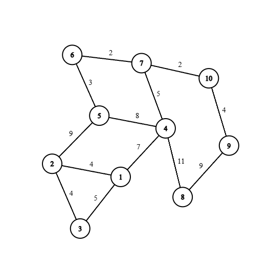

Link Sumber: 

---
> [!IMPORTANT]
# Minyak sedang Mahal!

Anton yang sedang bermain dengan nyaman tiba-tiba diminta oleh ibunya untuk membeli minyak. Harga minyak sedang mahal akhir-akhir ini, sehingga Ibunya mencoba untuk menghemat penggunaan minyak dirumah, tapi ternyata sia-sia saja. Beruntungnya, Ibu Anton adalah seseorang yang cerdik, dan mungkin... licik 😏. 

Akan ada satu toko baru yang akan dibuka, dengan semua barang dan produk masih tersedia, termasuk minyak tentu saja. Ibu Anton mengetahui kapan jam buka dari toko baru tersebut, dan mencoba untuk membeli semua minyak yang ada. Oleh karena itu, karena waktu yang semakin menipis, Anton harus cepat-cepat sampai ke toko tersebut, dan keluar dari toko dengan membawa semua minyak secepat mungkin.

Terdapat $n$ tempat dengan $m$ jalan, setiap tempat memiliki masing-masing jarak berupa $w$. Tentukan jalur terpendek untuk mencapai toko tersebut, jika rumah anton adalah $x$ dan toko tersebut adalah $y$.

#### Input

Baris pertama berisi $n$ dan $m$, yang merupakan banyaknya tempat dan banyaknya edge, dengan $2 \leq n \leq 1000$, dan $1 \leq m \leq 3000$. Dijamin bahwa $n \leq m$.

$m$ baris selanjutnya diisi oleh $u,v,w$, yang menujukan bahwa tempat $u$ dan $v$ terhubung oleh edge dengan panjang $w$, dengan $1 \leq u,v \leq n$, dengan $1 \leq w \leq 100000$.

Baris terakhir diisi oleh $x$ dan $y$, menunjukan lokasi tempat rumah Anton berada, dan lokasi toko tersebut, dijamin bahwa $1 \leq x,y \leq n$.

#### Output
Outputkan total jarak tempuh terpendek pada baris pertama, lalu tempat apa saja yang dilalui dengan dipisahkan spasi pada baris kedua.

#### Contoh

Input:
```cpp
10 13
1 2 4
1 3 5
1 4 7
2 3 4
4 5 8
5 2 9
5 6 3
6 7 2
4 8 11
8 9 9
9 10 4
7 10 2
4 7 5
1 10
```

Output:
```cpp
14
1 4 7 10
```

Ilustrasi:


<br/>

---
## Jawaban

<br/>

---
## Editorial

> [!TIP]
> Tujuan dari latihan ini adalah untuk mengenalkan konsep algoritma shortest path, atau pencarian jalur terpendek dengan menggunakan algoritma Bellman Ford. 

